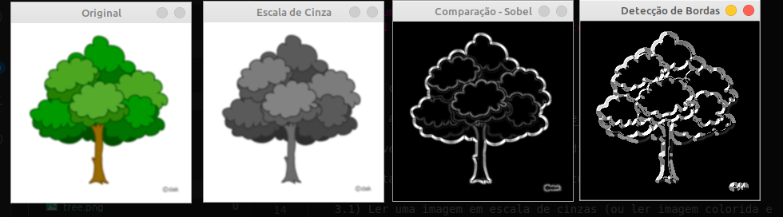

# Métodos Numéricos II
## Tarefa 01 - Derivada aplicada ao Processamento de Imagens

Esta tarefa consiste em:

1) Assistir ao vídeo https://www.youtube.com/watch?v=waNQ-7ckw0I

2) Desenvolver as máscaras de derivada discutidas no vídeo

3) Implementar o detector de bordas discutido no vídeo

    3.1) Ler uma imagem em escala de cinzas (ou ler imagem colorida e transformar para escala de cinzas)

    3.2) Ampliar a imagem para que ela tenha dois pixels a mais na direção horizontal (uma coluna de pixels à esquerda da imagem e uma coluna de pixels à direita da imagem) e dois pixels a mais na direção vertical (uma linha de pixels no topo da imagem e uma linha na base da imagem). Esses pixels adicionais terão valor de intensidade iguais a zero.

    3.3) usar uma máscara de derivada (abordagem central) e aplicá-la a cada pixel da imagem ampliada que não seja um pixel de borda. O resultado da aplicação da máscara sobre um pixel é copiado no pixel correspondente de uma imagem nova.

    3.4) Exibir a imagem original e a imagem nova.

Para rodar, execute isso na linha de comando: 
`python3 app.py imagem.png`

O output será o seguinte para `tree.png`:
