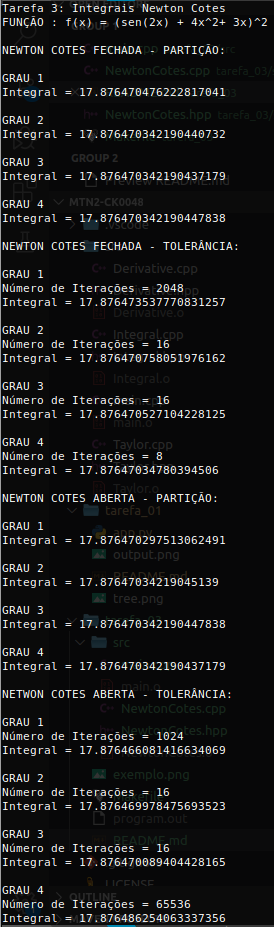

# Métodos Numéricos II
## Tarefa 03

Esta tarefa consiste em:

* Implemente as fórmulas Fechadas e Abertas da Aula#7 bem como as fórmulas que você desenvolveu para polinômios de substituição de grau 4 (Fechada e Aberta) e teste os resultados  com tolerância  de  10^-6.    O  seu  código (como  já  discutido  em  sala  de  aula) implementa a estratégia de partiçãodo problema. Veja,em cada caso, quantas iterações foram necessárias até atingir a tolerância especificada.

Para rodar, compile os arquivos com o comando: 
```
$ make
```

Em seguida, é só executar o binário de saída `program.out`.

O exemplo utilizado foi o dado no PDF da aula 8:


* Para os métodos de **partição**, foram utilizadas **10^4** iterações;
* Para os métodos de **tolerância**, foi utilizado **10^-6**.
* A **precisão** está setada para **20** casas decimais.

A saída será a seguinte:

