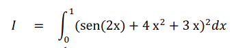
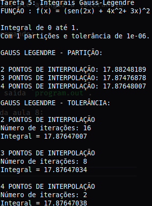

# Métodos Numéricos II

## Tarefa 05

Esta tarefa consiste em:

- Desenvolva a Quadratura de Gauss-Legendre com 4 pontos seguindo o roteiro apresentado nesta aula. Implemente as Quadraturas de Gauss-Legendre de 2 a 4 pontose teste os resultados com tolerância de 10-6. O seu código (como já discutido em sala de aula) implementa a estratégia de partição do problema. Veja, em cada caso, quantas iterações foram necessárias até atingir a tolerância especificada.

### Demonstração

A demonstração está no arquivo `demonstracao.pdf`.

### Implementação

Para rodar, compile os arquivos com o comando:

```
$ make
```

Em seguida, é só executar o binário de saída `program.out`.

O exemplo utilizado foi o dado no PDF da aula 11:



A saída será a seguinte:


